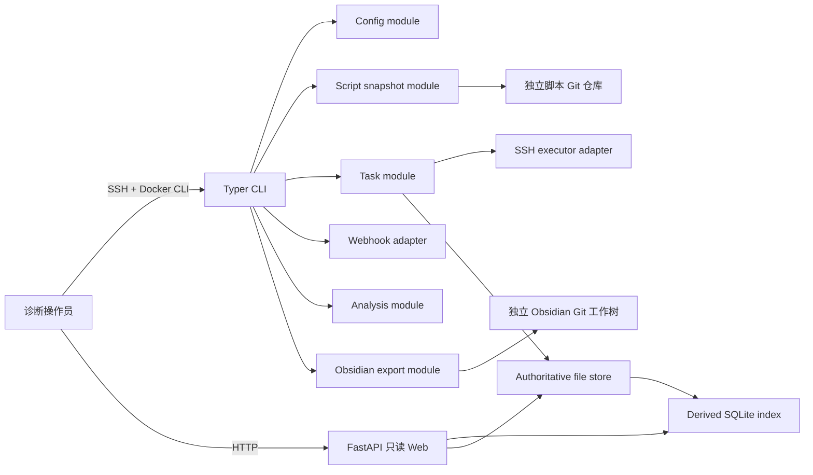

# WFT 节点诊断架构 v1.0

> 状态：Approved for Planning
> 目标版本：1.0.0
> 产品需求：`PRODUCT_REQUIREMENTS_v1.0.md`

## 1. 架构目标

WFT 采用单控制服务器、单 Python 镜像、文件权威存储的架构。复杂行为隐藏在少量深模块后，CLI 与只读 Web 只组合模块，不直接实现 Git、SSH、文件原子性、AI 或导出细节。



## 2. 运行拓扑

Docker Compose 使用同一镜像定义两个入口：

- `web`：常驻 FastAPI 进程，只读访问权威目录和派生索引；
- `wft`：按需 CLI 容器，执行写操作后退出。

共享挂载：

```text
/etc/wft/config.yaml       私有配置（0600）
/var/lib/wft/tasks/        权威任务目录
/var/lib/wft/index/        可重建 SQLite 索引
/var/lib/wft/scripts/      脚本 Git 缓存和不可变快照
/var/lib/wft/obsidian/     独立 Vault Git 工作树
/var/lib/wft/auth/         管理员密码哈希与 Session 数据
```

## 3. 模块与接口

### 3.1 `config` module

接口：`load_config(path) -> AppConfig`。

负责权限检查、YAML 解析、绝对路径规范化和跨字段校验。调用方不接触原始 YAML 字典。

### 3.2 `inventory` module

接口：

```python
load_inventory(path: Path) -> Inventory
select_nodes(inventory: Inventory, selector: NodeSelector) -> tuple[NodeSnapshot, ...]
```

负责唯一节点名、Ubuntu 目标声明、group/tag 选择和任务节点快照。它不读取私钥正文。

### 3.3 `scripts` module

接口：

```python
prepare_snapshot(request: SnapshotRequest, prompt: CachePrompt) -> ScriptSnapshot
```

该深模块隐藏 Git fetch、缓存回退确认、Manifest 校验、commit 解析、脚本哈希、路径逃逸防护和不可变快照创建。`CachePrompt` 是 CLI 交互 adapter；测试使用确定性 fake。

### 3.4 `tasks` module

接口：

```python
create_task(request: CreateTaskRequest, store: TaskStore) -> Task
run_task(task_id: str, store: TaskStore, executor: NodeExecutor) -> TaskOutcome
cancel_task(task_id: str, store: TaskStore) -> None
mark_abandoned_tasks_failed(store: TaskStore) -> int
```

该模块拥有状态机、并发上限、节点失败隔离、脚本顺序、安装结论聚合和 CLI 退出码映射。任务模块不理解 FastAPI、模板或 SQLite。

### 3.5 `execution` seam

接口：

```python
class NodeExecutor(Protocol):
    async def execute(self, node: NodeSnapshot, snapshot: ScriptSnapshot) -> NodeExecutionResult: ...
```

Adapters：

- `AsyncSSHNodeExecutor`：生产 SSH/SFTP 实现；
- `FakeNodeExecutor`：单元/容量测试实现。

Host Key 自动接受、解释器检查、超时、原始流落盘和远端清理由生产 adapter 隐藏。

### 3.6 `storage` module

接口由 `TaskStore` 提供少量业务操作，而不是暴露任意文件路径：

```python
create(task: Task) -> None
load(task_id: str) -> Task
commit_script_result(result: ScriptExecutionResult) -> None
commit_node_result(result: NodeExecutionResult) -> None
finish(task_id: str, outcome: TaskOutcome) -> None
delete(task_id: str) -> None
iterate_tasks() -> Iterator[Task]
```

文件实现负责 schema 版本、路径编码、同目录临时文件、fsync、原子 rename 和目录遍历。原始流由专用 writer 直接写文件，避免把大内容装入 JSON 或内存。

### 3.7 `index` module

接口：`sync()`, `rebuild()`, `query(filters)`, `task_detail(task_id)`。

SQLite 是派生 adapter；表可随时删除并从权威目录重建。任何写入 SQLite 的失败都不得反向修改权威文件。

### 3.8 `web` module

FastAPI 路由只调用 index 查询和受控原始文件 reader。除认证 Session 外没有业务写路由。实时页面以只读 HTML Fragment 轮询，不暴露任务执行接口。

### 3.9 外部集成 seams

- `WebhookSender.send(notification) -> DeliveryResult`：单次 HTTP adapter + fake；
- `AnalysisClient.analyze(chunk) -> AnalysisChunk`：OpenAI-compatible adapter + stub；
- `VaultWorktree.update(export) -> ExportResult`：Git/Markdown adapter + 临时 Git 仓库测试实现。

## 4. 建议源代码结构

```text
src/wft/
├── cli/
│   ├── app.py
│   └── commands/
├── config/
│   ├── models.py
│   └── loader.py
├── inventory/
│   ├── models.py
│   ├── loader.py
│   └── selector.py
├── scripts/
│   ├── models.py
│   ├── manifest.py
│   ├── git_source.py
│   └── snapshot.py
├── tasks/
│   ├── models.py
│   ├── state.py
│   ├── runner.py
│   └── conclusions.py
├── execution/
│   ├── interface.py
│   └── asyncssh_executor.py
├── storage/
│   ├── layout.py
│   ├── atomic.py
│   ├── task_store.py
│   └── raw_streams.py
├── index/
│   ├── schema.py
│   └── sqlite_index.py
├── web/
│   ├── app.py
│   ├── auth.py
│   ├── views.py
│   ├── templates/
│   └── static/
├── notification/
├── analysis/
├── problems/
└── export/
```

文件必须按职责拆分；CLI 命令和 Web 路由不得变成业务逻辑容器。

## 5. 核心数据流

### 5.1 创建并运行任务

1. CLI 加载私有配置和节点清单；
2. scripts module 尝试获取远端最新提交，必要时要求显式缓存确认；
3. 解析 Manifest，创建脚本快照和节点快照；
4. storage module 原子创建 `PENDING` 任务；
5. tasks module 变更为 `RUNNING`，以 semaphore=10 调度节点；
6. 每个节点依次运行脚本，每个脚本结果独立提交；
7. 节点结果提交后更新任务进度；
8. 所有节点终态后计算任务状态、安装结论和退出码；
9. 同步派生索引并单次发送适用的 Webhook。

### 5.2 崩溃和取消

- CLI 捕获 Ctrl-C，停止新调度、取消在途执行、提交可提交结果并标记 `CANCELLED`。
- 无法捕获的崩溃会留下 `RUNNING`；下一次 CLI/Web 启动先执行 abandoned-task 扫描并标记 `FAILED`。
- 不恢复、不重跑、不覆盖旧任务。

### 5.3 AI 与导出

- AI 从完整权威记录构建有预算的分块输入，生成版本化分析或规则摘要。
- problems module 把失败检查变成待分类问题，并允许 AI 在同一节点内归并。
- export module 生成任务索引和问题 Markdown，只替换 managed 区块。

## 6. 安全与数据边界

- 配置中的 SSH/Git 路径和 AI/Webhook 明文凭据不得进入任务 JSON 或日志。
- 目标脚本输出被视为操作员负责的数据；WFT 不扫描或脱敏。
- 原始文件下载必须经过登录检查、任务路径解析和白名单文件类型校验，禁止任意路径读取。
- 节点名和标题必须经过稳定路径编码，显示值仍保存在 JSON 中。
- HTTP、自动 Host Key、root/sudo、无 Git 签名和无备份是明确风险，不由实现层伪装为安全保证。

## 7. 版本与迁移

- 1.0 数据从 `schema_version: "1.0"` 开始。
- 读取未知主版本必须拒绝，不得猜测。
- SQLite 索引 schema 独立版本化且可重建。
- 不读取或迁移旧 MVP SQLite/YAML/Contract-01～12 数据。
